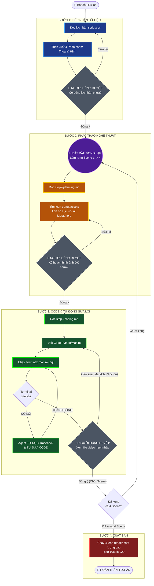

# 🗺️ SƠ ĐỒ LUỒNG LÀM VIỆC: AI MANIM VIDEO PRODUCER

## 📊 Sơ đồ Khối (Workflow Diagram)

# 👨‍💻 Vai trò của Người dùng (Human-in-the-loop)

Hệ thống được thiết kế để tự động hóa 90% công việc lập trình. 10% còn lại là quyết định của bạn. Bạn chỉ cần lên tiếng tại 3 điểm chốt chặn (Nút nét đứt trên sơ đồ):

## 📍 Chốt chặn 1 (Sau Bước 1)**: Duyệt Kịch bản
- **Agent làm gì**: Đọc file CSV, ghép Lời thoại với Mô tả hình ảnh.
- **Bạn làm gì**: Kiểm tra xem Agent có lấy nhầm dòng tiêu đề làm kịch bản không. Bấm OK để Agent bắt đầu nghĩ ý tưởng cho Phân cảnh 1.

## 📍 Chốt chặn 2 (Sau Bước 2): Duyệt Ý tưởng (Storyboard)
- **Agent làm gì**: Trình bày ý tưởng thay thế Text bằng Hình ảnh/Đồ thị, báo cáo các Icon lấy từ thư mục assets/.
- **Bạn làm gì**: Nếu bạn thấy ý tưởng hay, gõ OK, code đi. Nếu bạn muốn đổi, gõ ví dụ: "Đừng vẽ hình tròn, hãy vẽ một cái bập bênh". Agent sẽ sửa kế hoạch trước khi code.

## 📍 Chốt chặn 3 (Sau Bước 3): Nghiệm thu Video Nháp
- **Agent làm gì**: Nó sẽ tự động đánh vật với Terminal. Nếu có lỗi Code, nó tự đọc log và tự sửa. Nó CHỈ GỌI BẠN khi video nháp chất lượng thấp (-pql) đã được render thành công.
- **Bạn làm gì**: Mở file video nháp lên xem.
    Nếu chữ bị lệch, gõ: "Chữ bị lệch, đẩy lên trên 1 chút".
    Nếu thời gian bị chậm, gõ: "Hiệu ứng hiện ra nhanh hơn chút".
    Nếu hoàn hảo, gõ: "Chốt. Chuyển sang làm Scene tiếp theo".
*(Quá trình này lặp lại 4 lần cho 4 phân cảnh. Sau khi bạn chốt Scene 4, Agent sẽ tự động ghép và xuất bản video nét căng ở Bước 4).*